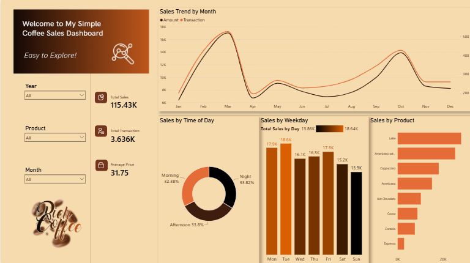

# Rich Coffee — Sales Performance & Consumer Behavior Dashboard

> **Summary:** An interactive Power BI business intelligence dashboard analyzing temporal demand cycles, consumer daypart purchasing patterns, product mix contribution, and transaction volume for **Rich Coffee**, tracking over **115.43K in total revenue across 3,636 transactions**.

---

## 1. Business Questions
To optimize cafe operations, staffing schedules, and inventory management, this project answers key commercial questions:
* How do sales revenue and transaction volumes fluctuate seasonally across different months of the year?
* How is consumer demand distributed across operating dayparts (Morning, Afternoon, Night)?
* Which days of the week experience peak customer footfall and gross sales?
* Which coffee beverages drive the highest proportion of gross revenue versus niche, low-volume offerings?
* What is the average price per item/ticket, and how can promotional bundling be leveraged to increase basket size?

---

## 2. Tools & Technologies Used
* **Power BI Desktop:** Data modeling, calculated measures, time-intelligence DAX, interactive slicers, and UI/UX visual layout design.
* **Microsoft Excel / Power Query:** Data schema auditing, data type conversions, null handling, and categorical dimension validation.
* **Git & GitHub:** Version control, portfolio structure, and technical documentation.

---

## 3. Data Source & Dataset Description
* **Dataset File:** `Data/coffee_sales_raw.csv`
* **Scope & Volume:** 3,500+ granular transactional records covering multi-month beverage purchases.
* **Schema Breakdown:**

| Column Name | Data Type | Description |
| :--- | :--- | :--- |
| `Date` | Date | Calendar date of transaction |
| `Time` | Time | Specific timestamp of order completion |
| `hour_of_day` | Integer | Operational hour (24-hour format, 6 to 22) |
| `Time_of_Day` | Text | Daypart segment (`Morning`, `Afternoon`, `Night`) |
| `Weekday` | Text | Day of the week (`Mon`, `Tue`, `Wed`, etc.) |
| `Weekdaysort` | Integer | Chronological weekday sorting index (1 = Mon ... 7 = Sun) |
| `Month_name` | Text | Full/abbreviated calendar month |
| `Monthsort` | Integer | Chronological month sorting index (1 to 12) |
| `coffee_name` | Text | Beverage item purchased (e.g., Latte, Americano with Milk, Cappuccino) |
| `cash_type` | Text | Payment tender type (Card) |
| `money(Rs)` | Decimal | Unit price / transaction revenue value |

---

## 4. Analytical & Dashboarding Process

### A. Data Ingestion & Transformation
* Standardized time formats to segment hours into three distinct operational buckets (`Morning`: 6 AM–11 AM, `Afternoon`: 12 PM–5 PM, `Night`: 6 PM–10 PM).
* Utilized `Monthsort` and `Weekdaysort` to ensure chronological axis alignment in Power BI charts (preventing default alphabetical sorting like April $\rightarrow$ August).

### B. DAX Modeling & Calculated Measures
Engineered explicit measures within the `coffee_data` table to evaluate core business KPIs:

```dax
-- Total Revenue
Total Sales = SUM(coffee_data[money(Rs)])

-- Total Volume of Purchases
Total Transaction = COUNTROWS(coffee_data)

-- Average Ticket Size
Average Price = DIVIDE([Total Sales], [Total Transaction], 0)
C. Visual Layout & UX Design
Applied an ambient coffee color palette (espresso dark brown, amber, and warm cream tones) to elevate visual hierarchy and user experience.

Integrated global interactive slicers for Year, Product, and Month to enable seamless cross-filtering across all visual cards.

## 5. Dashboard Preview



## 6. Key Findings & Commercial Insights
Bimodal Seasonal Revenue Spikes:

Revenue peaks dramatically twice a year: a primary surge in March (~17K sales / ~490 transactions) and a secondary wave in October (~14K sales / ~420 transactions).

Mid-year performance stabilizes between April and July, with the slowest revenue periods occurring during the winter transition (November–December).

Balanced Daypart Distribution:

Demand is evenly distributed across the entire operating day:

Night: 33.82%

Afternoon: 33.80%

Morning: 32.38%

Footfall remains high well beyond the traditional morning rush, proving strong evening cafe patronization.

Weekday Dominance Over Weekends:

Tuesday (18.6K) and Monday (17.9K) generate peak weekly revenue, closely followed by Friday (17.3K).

Weekend sales decline, with Sunday (13.9K) and Saturday (15.2K) representing the lowest sales days.

Product Revenue Engines (Latte & Americano Lead):

Latte and Americano with Milk are the primary revenue anchors, followed by Cappuccino and classic Americano.

Specialty/niche drinks such as Espresso, Cortado, Cocoa, and Hot Chocolate represent smaller revenue contributions.

## 7. Strategic Recommendations
Barista Shift Scheduling: Maintain full staffing capacity across all three dayparts on Monday, Tuesday, and Friday to handle consistent throughput.

Weekend Revenue Boosters: Introduce weekend-exclusive promotions (e.g., artisan bakery combos or loyalty point multipliers) to lift Saturday and Sunday footfall.

Seasonal Drink Launches: Launch limited-edition promotional drinks during the peak demand cycles in March and October to maximize high customer propensity to spend.

Menu Bundling Strategy: Create high-margin combo deals pairing lower-volume specialty drinks (Cortado, Espresso) with snacks or pastries to boost basket size.

## 8. Repository File Structure
Plaintext
Rich-coffee-sales-analysis/
│
├── README.md
├── Data/
│   └── coffee_sales_raw.csv
├── Power bi/
│   └── rich_coffee_dashboard.pbix
└── Screenshots/
    └── coffee_sales_dashboard.png
## 9. Next Steps & Future Enhancements
Customer Identification & Loyalty Tracking: Integrate customer IDs to analyze repeat purchase frequency, churn rates, and customer lifetime value (CLV).

Cost of Goods Sold (COGS) Integration: Ingest raw ingredient and packaging costs to evaluate gross profit margin by drink rather than relying solely on top-line revenue.

Hourly Footfall Heatmaps: Expand dayparts into an hour-by-hour operational matrix to optimize machine maintenance cycles and barista shift handovers.